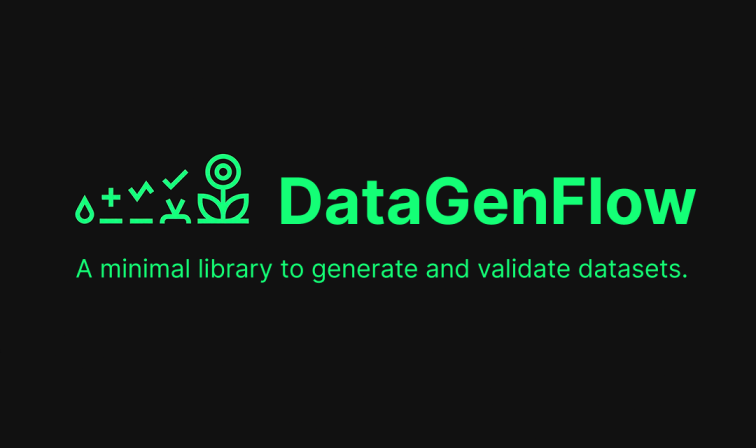

<div align="center">
  
  <p>
    <a href="#quick-start">Quick Start</a> •
    <a href="#how-it-works">How It Works</a> •
    <a href="#documentation">Documentation</a>
  </p>

  [](https://opensource.org/licenses/Apache-2.0)
  [](https://www.python.org/downloads/)
  [](https://github.com/nicofretti/DataGenFlow)
</div>

<div align="center">

https://github.com/user-attachments/assets/7ca7a319-e2c1-4e24-a4c7-2b098d692aa1

**Define seeds → Build pipeline → Review results → Export data**

[Watch full demo](images/video/full_video.mp4)

</div>

## Why DataGenFlow 🌱

DataGenFlow transforms complex data generation workflows into intuitive visual pipelines. A minimal tool to help you generate and validate data from seed templates with full visibility.

### Key Benefits

- Easy to Extend: Add custom blocks in minutes with auto-discovery
- Faster Development: Visual pipeline builder eliminates boilerplate code
- Simple to Use: Intuitive drag-and-drop interface, no training required
- Full Transparency: Complete execution traces for debugging

## Quick Start

Get started in under 2 minutes:

```bash
# Install dependencies
make setup
make dev

# Launch application (backend + frontend), make sure to have .env configured
make run-dev

# Open http://localhost:8000
```

**That's it!** No complex configuration, no external dependencies required.

## How It Works

### TL;DR - Visual Overview

Example of a simple pipeline generating text based on seed data:
```
┌─────────────────────────────────────────────────────────────────────────┐
│ 1. SEED DATA (JSON)                                                     │
│    { "repetitions": 2, "metadata": {"topic": "AI", "level": "basic"} }  │
└────────────────────────────────┬────────────────────────────────────────┘
                                 │
                                 ▼
┌─────────────────────────────────────────────────────────────────────────┐
│ 2. PIPELINE (Visual Drag & Drop)                                        │
│                                                                         │
│    ┌──────────────┐      ┌──────────────┐      ┌──────────────┐         │
│    │  LLM Block   │ ───► │  Validator   │ ───► │    Output    │         │
│    │              │      │    Block     │      │    Block     │         │
│    └──────────────┘      └──────────────┘      └──────────────┘         │
│                                                                         │
│    Accumulated State Flow:                                              │
│    topic, level  ─►  + assistant  ─►  + is_valid  ─►  + formatted       │
│                                                                         │
└────────────────────────────────┬────────────────────────────────────────┘
                                 │
                                 ▼
┌─────────────────────────────────────────────────────────────────────────┐
│ 3. GENERATION & REVIEW                                                  │
│    + Execute pipeline for each seed × repetitions                       │
│    + Review results with keyboard shortcuts (A/R/E)                     │
│    + View full execution trace for debugging                            │
└────────────────────────────────┬────────────────────────────────────────┘
                                 │
                                 ▼
┌─────────────────────────────────────────────────────────────────────────┐
│ 4. EXPORT                                                               │
│    Download as JSONL ─► Ready for training/integration                  │
└─────────────────────────────────────────────────────────────────────────┘
```

**Key Concept:** Each block adds data to the **accumulated state**, so subsequent blocks automatically have access to all previous outputs—no manual wiring needed!

---

### 1. Define Your Seed Data

Start by creating a JSON seed file with the variables your pipeline will use. Seeds define what data you want to generate.

Single seed:
```json
{
  "repetitions": 2,
  "metadata": {
    "topic": "Python programming",
    "difficulty": "beginner"
  }
}
```

Multiple seeds (generate different variations):
```json
[
  {
    "repetitions": 1,
    "metadata": {
      "topic": "Python lists",
      "difficulty": "beginner"
    }
  },
  {
    "repetitions": 1,
    "metadata": {
      "topic": "Python dictionaries",
      "difficulty": "intermediate"
    }
  }
]
```

Fields:
- `repetitions`: How many times to run the pipeline with this seed
- `metadata`: Variables accessible in your blocks via `{{ variable_name }}`

### 2. Build Your Pipeline Visually

Design your data generation workflow using drag-and-drop blocks. Each block processes data and passes it to the next one.

#### Built-in Blocks

Start with ready-to-use blocks:
- LLM Generator: Generate text using AI models (OpenAI, Ollama, etc.)
- Validator: Check quality (length, forbidden words, patterns)
- JSON Validator: Ensure structured data correctness
- Output Formatter: Format results for review page
- ... waiting for more!

#### Conversational AI Vertical

DataGenFlow includes research-backed algorithms for synthetic conversation generation:

- **Persona-Driven Dialogue** - Generate realistic multi-turn conversations with consistent character voices
- **Back-Translation Diversity** - Automatically create diverse variations while maintaining intent
- **Adversarial Perturbation** - Generate edge cases and robustness test scenarios
- **Quality Metrics** - Auto-computed scores for diversity, coherence, and engagement

Perfect for training conversational AI, chatbots, and dialogue systems. Get started with the pre-configured "Customer Service Conversations" template.

📚 Complete guide: [Conversational AI Vertical](docs/conversational-ai-vertical.md) | [Research Algorithms](docs/research-algorithms.md)

#### Extend with Custom Blocks

The real power of DataGenFlow is creating your own blocks. Add domain-specific logic in minutes with automatic discovery:

```python
from lib.blocks.base import BaseBlock
from typing import Any

class SentimentAnalyzerBlock(BaseBlock):
    name = "Sentiment Analyzer"
    description = "Analyzes text sentiment"
    inputs = ["text"]  # what this block needs from accumulated state
    outputs = ["sentiment", "confidence"]  # what it adds to accumulated state

    async def execute(self, data: dict[str, Any]) -> dict[str, Any]:
        text = data["text"]  # access from accumulated state
        sentiment = analyze_sentiment(text)

        # return values are added to accumulated state automatically
        return {
            "sentiment": sentiment.label,
            "confidence": sentiment.score
        }
```

Drop your file in `user_blocks/` and it's automatically discovered on restart—no configuration needed.

Why this matters:
- Adapt to your specific domain or workflow instantly
- Integrate proprietary validation logic or data sources
- Build reusable components for your team
- Share blocks as Python files—simple as copy/paste

**Debugging Custom Blocks**

Need to debug your custom block? Use the included `debug_pipeline.py` script with VS Code debugger. See [Developer Documentation](DEVELOPERS.md#debugging-custom-blocks) for details.

📚 Complete guide: [Custom Block Development](docs/how_to_create_blocks.md)

#### Accumulated State

Data flows automatically through your pipeline. Each block adds its outputs to an accumulated state that every subsequent block can access—no manual wiring:

```
    ┌─────────────────┐
    │   LLM Block     │ → outputs: {"assistant": "Generated text"}
    └─────────────────┘
        │
        ▼ (state: assistant)
    ┌─────────────────┐
    │ Validator Block │ → outputs: {"is_valid": true}
    └─────────────────┘
        │
        ▼ (state: assistant, is_valid)
    ┌─────────────────┐
    │  Output Block   │ ← can access both: assistant, is_valid
    └─────────────────┘
```

This makes building complex pipelines incredibly simple—connect blocks and they automatically share data.

### 3. Review and Refine

Review your results with keyboard shortcuts (Accept: A, Reject: R, Edit: E) and full execution traces to see how each result was generated.

### 4. Export Your Data

Export your data in JSONL format, filtered by status (accepted, rejected, pending).

## Configuration

Create `.env` file (or copy from `.env.example`):

```bash
# LLM Configuration
LLM_ENDPOINT=http://localhost:11434/v1  # Ollama, OpenAI, etc.
LLM_API_KEY=                            # Optional for some endpoints
LLM_MODEL=llama3.2

# Database
DATABASE_PATH=data/qa_records.db

# Server
HOST=0.0.0.0
PORT=8000

# Debug mode (optional)
DEBUG=false  # set to true for detailed logging
```

## Documentation

📖 Comprehensive Guides
- [How to Use DataGenFlow](docs/how_to_use.md) - Complete user guide
- [Custom Block Development](docs/how_to_create_blocks.md) - Extend functionality
- [Developer Documentation](DEVELOPERS.md) - Technical reference for developers

## Contributing

Contributions are welcome and appreciated. Before submitting a contribution, please review the guidelines below.

Prerequisites:
- Read the [Contributing Guidelines](CONTRIBUTING.md) thoroughly
- Check existing issues and pull requests to avoid duplication
- Follow the project's commit conventions and code style standards

Areas for Contribution:
- New processing blocks and pipeline templates
- Documentation improvements and examples
- Bug fixes and performance optimizations
- Test coverage expansion
- Integration examples and use cases

For detailed technical requirements and development setup, refer to the [Developer Documentation](DEVELOPERS.md).

## Design Strategy

DataGenFlow is built on the **KISS principle** (Keep It Simple, Stupid):

- Minimal Abstraction: Direct, understandable code over clever tricks
- Flat Architecture: Simple structure over deep nesting
- Explicit Design: Clear intentions over implicit magic
- Composition First: Combine simple pieces over complex inheritance
- Developer Friendly: Easy to understand, modify, and extend

Result: Simple, understandable code that's easy to maintain and extend.

---

<div align="center">

[Get Started](#quick-start) • [View Documentation](#documentation)

Happy Data Generating! 🌱

</div>