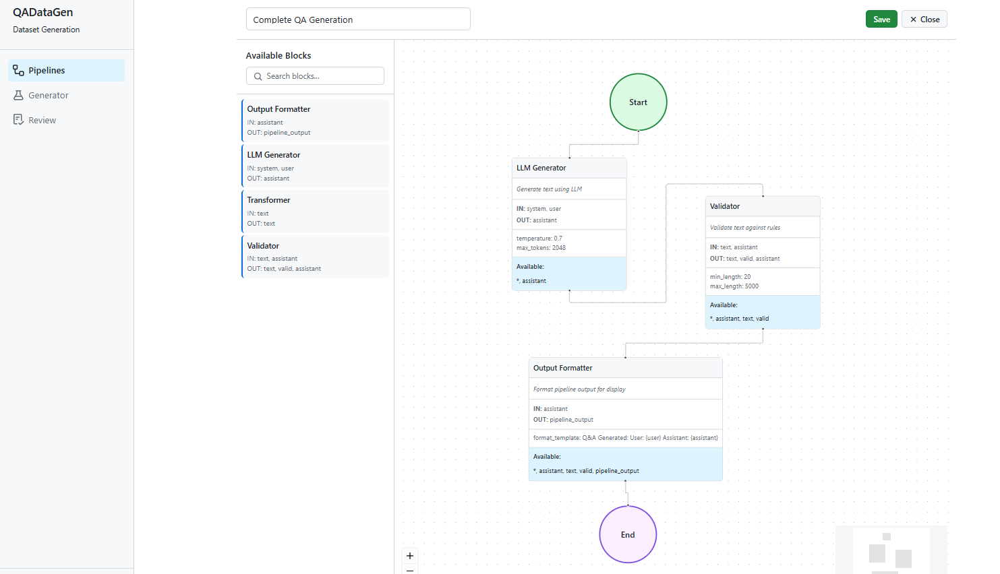
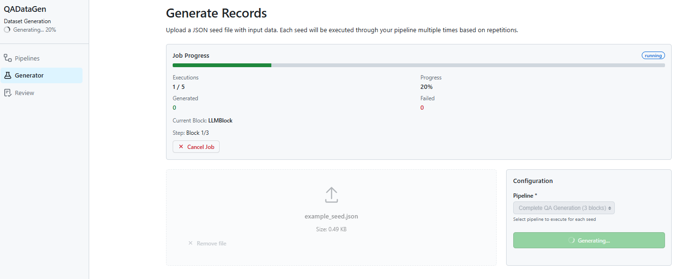
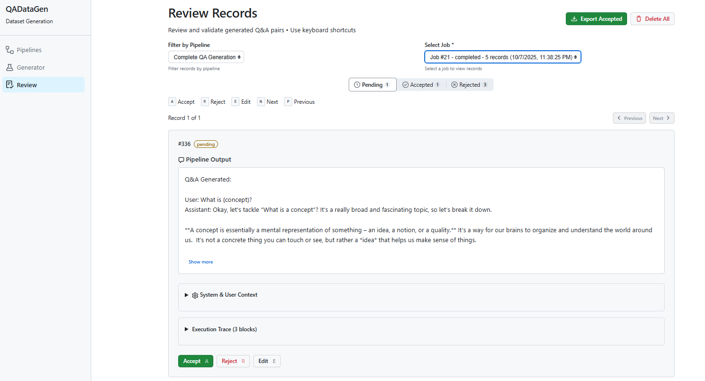

# QADataGen

Q&A dataset generation tool with block-based pipeline system.

<div align="center">
  
  <br/>
  <em>Visual pipeline builder with drag-and-drop interface</em>

  
  <br/>
  <em>Generate records from seed data using configured pipelines</em>

  
  <br/>
  <em>Review, edit, accept/reject generated records with trace visualization</em>
</div>

## Quick Start

```bash
# Install dependencies
make setup
make dev

# Start server
make run

# Open browser
# http://localhost:8000
```

## Configuration

Create `.env` file (or copy from `.env.example`):

```bash
# LLM Configuration
LLM_ENDPOINT=http://localhost:11434/v1  # Ollama, OpenAI, etc.
LLM_API_KEY=                            # Optional for some endpoints
LLM_MODEL=llama3.2

# Database
DATABASE_PATH=data/qa_records.db

# Server
HOST=0.0.0.0
PORT=8000

# Debug mode (optional)
DEBUG=false  # set to true for detailed logging
```

## Creating Custom Blocks

Create a file in `lib/blocks/custom/` or `user_blocks/`:

```python
from lib.blocks.base import BaseBlock
from typing import Any

class MyBlock(BaseBlock):
    name = "My Block"
    description = "Does something useful"
    inputs = ["text"]
    outputs = ["result"]

    async def execute(self, data: dict[str, Any]) -> dict[str, Any]:
        # Your logic here
        result = data["text"].upper()
        return {"result": result}
```

The block is auto-discovered on startup and immediately available in the UI.

## Features

### Core System
- **Block-based pipelines**: Compose workflows from reusable blocks
- **Visual pipeline builder**: Drag-and-drop UI for creating pipelines
- **Execution tracing**: Full state history with timing for debugging
- **Pipeline templates**: Pre-configured pipelines for quick start
- **Custom blocks**: Easy extension with auto-discovery

### Built-in Blocks
- **LLMBlock**: Generate text using LLM (OpenAI-compatible)
- **TransformerBlock**: Text transformations (lowercase, uppercase, strip, trim)
- **ValidatorBlock**: Validate output against rules (length, forbidden words)
- **FormatterBlock**: Format pipeline output for display

### Developer Experience
- **Debug logging**: Toggle detailed execution logs with `DEBUG=true`
- **Trace IDs**: Track pipeline executions across logs and API responses
- **Execution timing**: Per-block timing in trace output
- **Error handling**: Structured error responses with context
- **Test isolation**: Separate test database, auto-cleanup

### Web UI
- **Builder**: Visual pipeline creation with drag-and-drop
- **Pipelines**: Manage and execute pipelines
- **Generator**: Generate Q&A datasets from seeds
- **Review**: Review, edit, accept/reject generated records with trace visualization

## [CLI] Using Pipeline Templates

Quick start with pre-configured pipelines:

```bash
# list available templates
curl http://localhost:8000/api/templates

# create pipeline from template
curl -X POST http://localhost:8000/api/pipelines/from_template/text_generation

# execute the pipeline
curl -X POST http://localhost:8000/api/pipelines/1/execute \
  -H "Content-Type: application/json" \
  -d '{"system": "You are helpful", "user": "Hello"}'
```

Available templates:
- `text_generation` - Simple LLM generation
- `validated_generation` - LLM + validation
- `text_transformation` - Text transformation chain
- `complete_qa_generation` - Full QA pipeline with validation and formatting

## API Endpoints

### Blocks
- `GET /api/blocks` - List all registered blocks with schemas

### Templates
- `GET /api/templates` - List available pipeline templates
- `POST /api/pipelines/from_template/{template_id}` - Create pipeline from template

### Pipelines
- `POST /api/pipelines` - Create pipeline
- `GET /api/pipelines` - List all pipelines
- `GET /api/pipelines/{id}` - Get pipeline by ID
- `DELETE /api/pipelines/{id}` - Delete pipeline
- `POST /api/pipelines/{id}/execute` - Execute pipeline, returns `{result, trace, trace_id}`

### Records
- `GET /api/records` - List records (supports status, limit, offset)
- `GET /api/records/{id}` - Get record by ID
- `PUT /api/records/{id}` - Update record
- `DELETE /api/records` - Delete all records
- `GET /api/export` - Export records as JSONL
- `GET /api/export/download` - Download export as file

### Generation
- `POST /api/generate` - Generate records from seed file using pipeline

## Testing

```bash
# Run all tests
make test

# Run specific test suite
uv run pytest tests/blocks/ -v
uv run pytest tests/test_api.py -v

# Run with coverage
uv run pytest --cov=lib --cov=app tests/
```

Tests use a separate database (`data/test_qa_records.db`) that is automatically created and cleaned up. See `TEST_DATABASE.md` for details.

## Development

```bash
# Backend server
make run

# Frontend development
cd frontend && yarn dev

# Code quality
make lint      # Run linting
make typecheck # Run type checking
make format    # Format code
```

## Architecture

```
lib/
  blocks/
    builtin/          # Stable blocks (llm, transformer, validator, formatter)
    custom/           # Experimental blocks
    base.py           # BaseBlock interface
    registry.py       # Auto-discovery engine
  templates/          # Pipeline templates
  errors.py           # Custom exception classes
  workflow.py         # Pipeline execution with tracing
  storage.py          # Database operations
  generator.py        # LLM wrapper

frontend/
  src/pages/
    Builder.tsx       # Visual pipeline builder
    Pipelines.tsx     # Pipeline manager
    Generator.tsx     # Dataset generation
    Review.tsx        # Review records with trace

tests/
  conftest.py         # Test configuration
  blocks/             # Block unit tests
  test_api.py         # API endpoint tests
  test_workflow.py    # Pipeline execution tests
```

## Error Handling

The system includes comprehensive error handling:

- **BlockNotFoundError**: When a block type doesn't exist (shows available blocks)
- **BlockExecutionError**: When a block fails (includes block name, step number, context)
- **ValidationError**: When a block returns undeclared fields (shows expected vs actual)

All errors return structured JSON responses with error messages and context for debugging.

## Debug Mode

Enable debug logging to see detailed execution information:

```bash
# In .env
DEBUG=true
```

When enabled:
- Logs include trace IDs for correlation
- Per-block execution timing
- Detailed block name and step information

Example log output:
```
2025-10-06 10:15:32 [INFO] [a1b2c3d4-...] Starting pipeline 'Simple Text Generation' with 1 blocks
2025-10-06 10:15:32 [DEBUG] [a1b2c3d4-...] Executing block 1/1: LLMBlock
2025-10-06 10:15:35 [DEBUG] [a1b2c3d4-...] LLMBlock completed in 3.124s
2025-10-06 10:15:35 [INFO] [a1b2c3d4-...] Pipeline 'Simple Text Generation' completed successfully
```

## Status

✅ **112 tests passing, 2 skipped**

- Block-based pipeline system with auto-discovery
- Execution tracing with timing
- Error handling with structured responses
- Pipeline templates for quick start
- Debug logging with trace IDs
- Test database isolation
- Full CRUD for pipelines and records
- Web UI with visual builder and trace visualization

## KISS Principles

This project follows Keep It Simple, Stupid principles:
- Minimal abstraction layers
- Flat structure over deep nesting
- Explicit over implicit
- Simple composition over inheritance
- Easy to understand and modify
